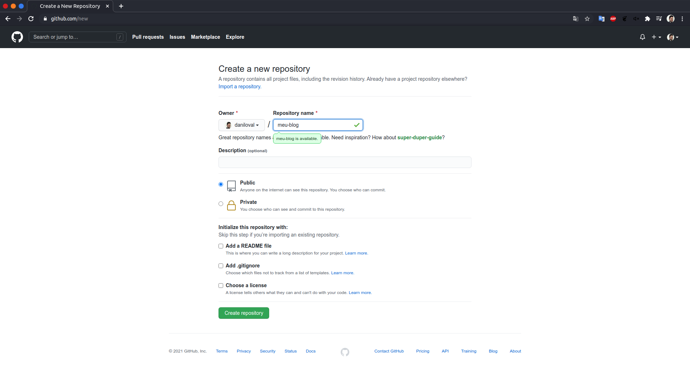
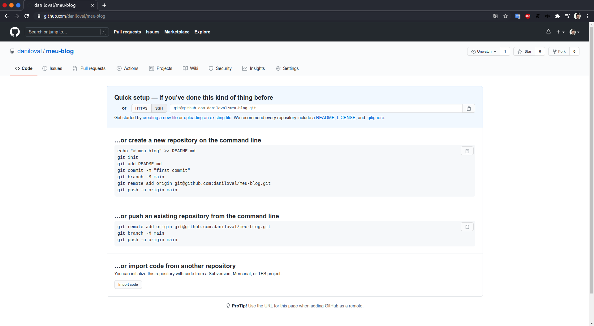
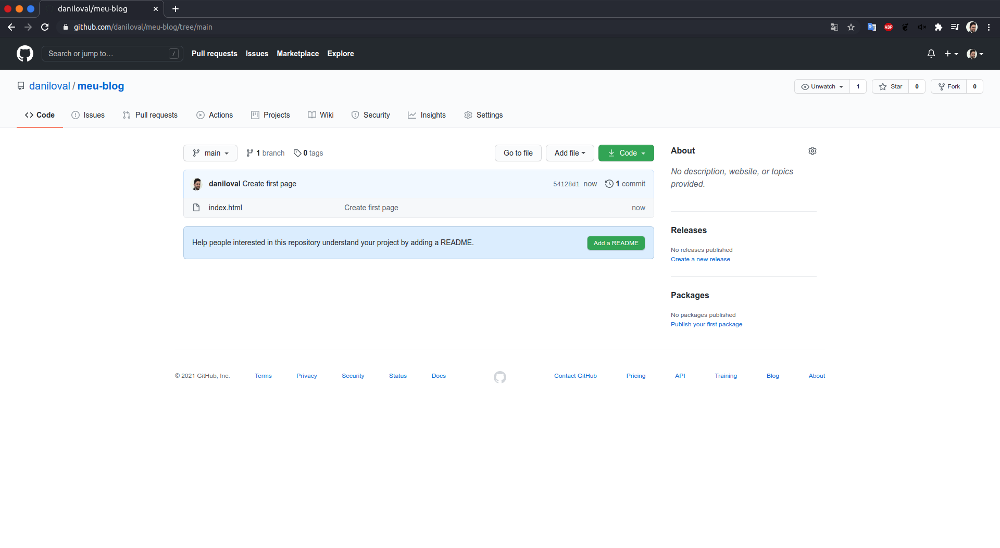
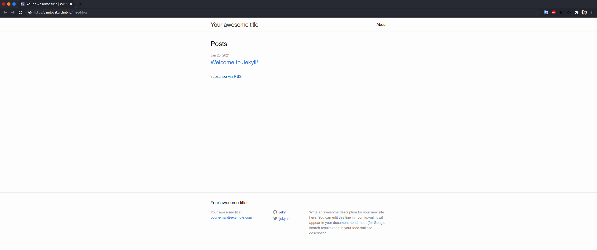

Há um grande número de plataformas disponíveis para você escolher por onde começar um blog. WordPress é provavelmente o mais conhecido dentro todos, afinal ele domina quase [40% de toda a interweb][1], mas produtos como Medium, Blogger ou Wix, para citar apenas alguns, também são alternativas populares e bastante poderosas.

Todas essas opções nos entregam resultados similares, porém, com algumas pequenas mudanças em seu respectivo funcionamento. Algumas gratuitas, outras pagas ou com inserção de publicidade vinculada aos posts. Algumas cuidam da hospedagem para você, outras precisam da execução de algum software em sua própria infraestrutura. Algumas permitem o uso de domínios personalizados, enquanto outras cobram uma taxa por isso. Parece quase impossível encontrar uma solução que preencha todas as necessidades.

Pensando em como faríamos as coisas por aqui, acabei por esbarrar com uma solução que geralmente não vem à mente quando pensamos em blogs, e que, obviamente, me mantém mais próximo do Maker, do mão na massa/faça você mesmo (DIY – Do It Yourself): [GitHub Pages][2],  qualquer repositório no [GitHub][3] pode ser transformado em um site associado ao workflow de desenvolvimento mais fácil do que você possa imaginar. Não é preciso executar nenhum software ou preocupar-se com configurações de servidor, sem FTP, SSH ou qualquer outro caminho, simplesmente fazemos push dos conteúdos para o repositório usando arquivos [markdown][4].

O GitHub oferece suporte para um número ilimitado de repositórios de forma gratuita, o que significa que você pode hospedar quantos blogs/sites julgar necessário, gratuitamente, sem publicidade. E ainda permite o uso de seu próprio domínio com [HTTPS][5]. Isso não parece um mau negócio, não é?

#### Em comparação com as plataformas de blog tradicionais

Para prosseguir, é bastante importante apontar algumas diferenças importantes entre as páginas do GitHub e as plataformas de blog mais tradicionais. Muitas dessas plataformas te oferecem um conjunto de interfaces visuais de onde você pode gerenciar seu conteúdo. Você já parou para pensar o que acontece entre a publicação e o lançamento, onde isso está de fato sendo armazenado. Caso o servidor repentinamente não esteja no ar, como você conseguiria acessar seus dados? É fácil extrair o conteúdo se você decidir migra-lo para qualquer outra plataforma?

Nesse sentido, o GitHub Pages é uma opção mais transparente. Por usar o protocolo [Git][6], você pode facilmente manter uma cópia do repositório em seu sistema local ou até mesmo configurar varias espelhos do seu conteúdo em provedores diferentes (como [Bitbucket][7] e [GitLab][8]), o post é armazenado em arquivos simples, sem interface mágica - ele simplesmente está lá.

Obviamente, isso também torna o GitHub Pages uma solução mais básica. Por exemplo, sem uma solução de gerenciamento de conteúdo pronta para seu uso (embora por meio dos pluggins você possa ter um) e, por baixo do capô, representa paradigmas totalmente diferentes do WordPress. Não tendo essencialmente um sistema onde pode-se buscar, gerar e manipular conteúdos dinâmicos em cada solicitação, o GitHub Pages permite apenas que você entregue arquivos estáticos, o que significa que suas páginas devem ser geradas com antecedência.

Esse paradigma, certamente, não é a escolha óbvia para certos aplicativos, mas para um blog geralmente é uma ótima opção. O conteúdo não deve mudar a cada poucos segundos e geralmente não precisa de geração automática, então, torna-se perfeitamente possível construir um conjunto de páginas estáticas toda vez que você faz uma nova postagem. Quando prontas, basta uma nova publicação (push) e seu conteúdo estará disponível no seu blog com GitHub em segundos.

#### Introdução às páginas do GitHub

Para começar, primeira vamos construir um repositório. Acesse [https://github.com/new][9] e você encontrará uma tela como está.



Depois de escolher um nome e uma descrição para seu repositório, selecione a opção Criar repositório. Caso tudo corra bem, você será direcionado à sua nova página de repositório. Nada muito diferente até aqui além do endereço/url de seu novo repositório. Anote-o, vamos usá-lo em um minuto.



Na sequência vamos construir nossa primeira página. Crie um novo diretório e em seguida crie um arquivo chamado ```index.html```, com algum HTML simples.

```html
<!DOCTYPE html>
<html>
<head>
  <title>Meu novo blog</title>
</head>
<body>
  <h1>Bem-vindo</h1>
  <p>É aqui que tudo começa!!!</p>
</body>
</html>
```

Agora vamos de publicá-lo. Existem várias maneiras de interagir com seu repositório. Para esse tutorial, vamos com o bom e velho terminal, já que usaremos uma lista simples de comandos. Se for de sua preferencia, use uma interface gráfica como o [GitHub Desktop][10].

Abra uma janela de terminal e navegue até o diretório no qual você salvou o arquivo.

```shell
cd /path/to/your/directory
```

Uma vez lá, digite os seguintes comandos:

```shell
git init
git remote add origin git@github.com:daniloval/meu-blog.git (replace this with your repository address)
git add index.html
git commit -m "Create first page"
git push origin master
```

O que fizemos aqui? Estamos iniciando um novo repositório Git no diretório que criamos e, em seguida, vinculando-o ao repositório GitHub. Na sequência, estamos adicionando ```index.html``` à lista de arquivos a serem publicados, enviando-os com uma mensagem que descreve a operação e, finalmente, enviando-os para o repositório remoto.

Se você atualizar a página do repositório no GitHub, deverá ver agora o arquivo que acabamos de enviar.



Por fim, precisamos habilitar as páginas do GitHub para este repositório. Na tela mostrada acima, clique em ```Configurações``` e role para baixo até a seção ```Páginas do GitHub```. No seletor de origem, selecione ```master``` como a ramificação a partir da qual construir e clique em ```Salvar```.

Depois disso, você verá uma mensagem confirmando que seu site está pronto para ser publicado e indicando uma URL de acesso. Se você navegar até ela, poderá ver seu novo site.


#### Inserindo o Jekyll na jogada

Criamos uma solução bastante funcional, mas na realidade ainda não muito prática. Mesmo sendo bom gerar manualmente as páginas HTML para este site de exemplo, não é um processo sustentável para um projeto de tamanho razoável.

Por exemplo, imagine que queremos criar uma página de destino para o nosso blog onde todas as postagens são listadas. Para cada entrada, queremos exibir o título, um trecho e um botão “Leia mais” que, quando pressionado, leva as pessoas para outra página onde a postagem completa é exibida. Isso significa que criar ou atualizar uma postagem de repente envolve a edição de dois arquivos. Uma vez que adicionamos coisas como paginação, categorias ou um agregador de tags, esse número começa a crescer e se torna incontrolável.

Ainda assim, se você desejar migrar seu conteúdo para um plataforma diferente no futuro, você certamente deseja que ele esteja em um formato e estrutura o mais bruto possível, separado de qualquer implementação ou tecnologia. Provavelmente, armazená-lo em arquivos HTML que estão inchados com marcações de apresentação não é a melhor maneira de fazer isso.

É aqui que entram os geradores de sites estáticos, que, nada mais são que softwares que transformam o conteúdo em vários formatos e criam páginas HTML. Isso significa pegar um diretório cheio de postagens de blog, em formato como Markdown, e gerar landing pages, páginas completas de post, paginação, páginas de agregação de tags, categorias, pesquisas e qualquer outra coisa que você possa imaginar. Tudo o que você precisa fazer é executar um comando (geralmente chamado de etapa de construção) e um site inteiro será gerado automaticamente para você.

Existem centenas de geradores de sites estáticos para que você escolha a melhor opção, neste post, vamos nos concentrar particularmente no [Jekyll][11]. A razão para isso é que ele possui status especial nas páginas do GitHub. Enquanto que com qualquer outro gerador de sites estáticos você precisa executar a etapa de compilação em sua máquina e apenas depois disso enviar os arquivos resultantes para seu repositório, com o Jekyll você pode simplesmente enviar os arquivos de origem e o GitHub Pages irá executar a etapa de compilação para você, publicando os arquivos resultantes automaticamente.

Para adicionar o Jekyll ao nosso blog, primeiro devemos deletar o arquivo index.html que criamos anteriormente.

```shell
rm -rf index.html
```

Em seguida, instale o Jekyll e diga a ele o nome do diretório onde deve criar o site. Devemos usar o diretório que criamos anteriormente, pois já está vinculado ao repositório GitHub. Acrescentei o parâmetro ```-f``` para evitar que o Jekkyl nos de um ```warning``` ou ```error``` sobre a existência do diretório com o nome no blog ```meu-blog```.

```shell
gem install bundler jekyll
jekyll new -f meu-blog
```

Para construir o site, execute ```jekyll serve```. Ele irá gerar todos os arquivos HTML e criar uma URL onde o site estará disponível. Cada vez que você modificar um arquivo, o site será regenerado e o URL refletirá suas alterações. Adicionado o parâmetro -l abaixo, ativamos a opção refresh/reload automático e suas alterações refletirão na URL sempre que você salvar qualquer alteração. 

Obs. essa opção não se aplica ao arquivo config e infelizmente você terá de recompilar o Jekyll sempre que estiver trabalhando em configurações.

```shell
bundle exec jekyll serve --livereload
```

ou

```shell
bundle exec jekyll serve -l
```

Se você estiver usando uma URL github.io (por exemplo ```username.github.io/repositorio```), você deve dizer ao Jekyll que o caminho base é ```/repositorio```. Para fazer isso, abra o arquivo ```_config.yml``` e defina a propriedade baseurl como ```/repositorio``` (no meu caso, ```meu-blog```).

Quando estiver pronto para colocar seu novo site Jekyll no ar, você pode executar:


```shell
git add .
git commit -m “Add Jekyll”
git push origin master
```

Em alguns segundos, você poderá atualizar o URL do GitHub e ver o seu novo site com tecnologia Jekyll em ação.



#### Escolhendo um tema para seu novo site em Jekyll

Para alterar a aparência do seu site, você pode experimentar diferentes temas. Uma busca rápida por “temas jekyll” levará você a diversas opções de temas, com diferentes layouts e estilos. Quando você encontrar um de que goste, poderá ativá-lo [adicionando-o ao arquivo de configuração][12].

Como mais uma opção, você também pode buscar pelas várias possibilidades do GitHub. Para experimentá-las, vá para Configurações, busque por Páginas do GitHub e pressione a opção Alterar tema. Você verá uma prévia de cada tema disponível e, assim que encontrar um de que goste, clique em Selecionar tema e seu site será atualizado de acordo.


 [1]: https://w3techs.com/technologies/history_overview/content_management/all
 [2]: https://pages.github.com/
 [3]: https://github.com/
 [4]: https://en.wikipedia.org/wiki/Markdown
 [5]: https://pt.wikipedia.org/wiki/Hyper_Text_Transfer_Protocol_Secure
 [6]: https://git-scm.com/
 [7]: https://bitbucket.org/
 [8]: https://about.gitlab.com/
 [9]: https://github.com/new
 [10]: https://desktop.github.com/
 [11]: https://jekyllrb.com/
 [12]: https://jekyllrb.com/docs/themes/#installing-a-theme


